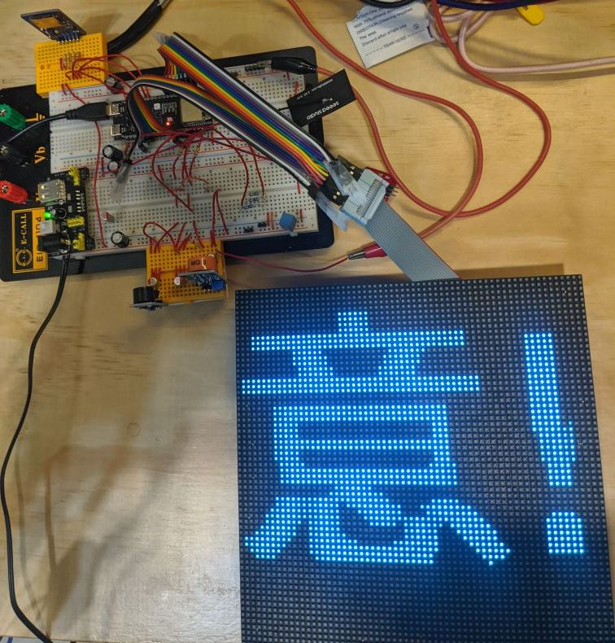

# Traditional Chinese scrolling text on a 64x64 LED matrix (ESP32-S3)

Scrolling Traditional Chinese text on a Waveshare 64x64 HUB75 panel. The text is drawn once into a buffer in PSRAM and then copied to the panel frame by frame, which keeps it smooth (120+ FPS) without flicker.

https://github.com/user-attachments/assets/081b6dae-b0a2-4cd4-9848-4d3ffebd0bb0

## Hardware

- ESP32-S3-DevKitC-1U-N8R8 (8 MB flash, 8 MB octal PSRAM). The PSRAM settings in `platformio.ini` are needed; the "1U" board has a connector for an external antenna instead of a built-in one.
- [Waveshare RGB-Matrix-P3-64x64](https://www.waveshare.com/rgb-matrix-p3-64x64-f.htm), HUB75E input (pin 8 is address line E; on 32-pixel-high HUB75 panels it is ground).
- 5 V 4 A power supply, connected to the panel's own power header, not through the ESP32.

## Wiring

Direct wires, no level shifter needed with this panel.

| Panel | GPIO | Wire colour |
| --- | --- | --- |
| R1 | 4 | red |
| G1 | 41 | green |
| B1 | 5 | blue |
| R2 | 6 | red |
| G2 | 40 | green |
| B2 | 7 | blue |
| A | 15 | yellow |
| B | 48 | orange |
| C | 16 | brown |
| D | 47 | white |
| E | 39 | black |
| LAT | 21 | purple |
| OE | 18 | grey |
| CLK | 17 | black |
| GND | GND | black - the panel and the ESP32 must share ground |

## Building

Open the folder in PlatformIO and upload. `platformio.ini` sets the octal PSRAM (`qio_opi`), LittleFS and `partitions_custom.csv`, which reserves 5 MB of flash for the font. The libraries (ESP32 HUB75 LED MATRIX PANEL DMA Display, Adafruit GFX, OpenFontRender) are installed by PlatformIO.

## Font

The program loads `/font.ttf` from the board's flash. Put the font in `data/font.ttf` and upload it once with PlatformIO: Project Tasks > Platform > Upload Filesystem Image.

`data/font.ttf` in this repo is a cut-down [Taipei Sans TC](https://github.com/VdustR/taipei-sans-tc): only ASCII, the 4808 common characters from the Ministry of Education list and the Chinese punctuation, about 3 MB instead of 20 MB. It looks best at larger sizes (40 px and up).

To make the cut-down file yourself, use the folder `1_subsetting fonts_ttf_to_ttf/`: run `One-Click Script for Font Generation.bat` (needs Python and fonttools). It reads `tw_edu_common_4808_chars.txt` and `basic_latin.txt`; the `README.txt` there has the details.

A pixel-style alternative is [Cubic 11](https://github.com/ACh-K/Cubic-11) (`Cubic_11.ttf` in the same folder, about 2.7 MB, no cutting needed): rename it to `font.ttf` and put it in `data/`.

## Changing the text

- In `src/main.cpp`: `currentText`, plus `fontSize`, `brightness`, `scrollDelay`, `scrollStep` and the rainbow settings near the top.
- Over USB: open the serial monitor (115200 baud), type a text and press Enter.
- `COLOR 255 0 0` in the serial monitor sets a solid colour. It is used when `useRainbow` is `false` in `main.cpp`.

## Problems

- Text broken in the middle: Waveshare panels often shift the bottom half by one pixel. Set `bottomHalfOffset` in `main.cpp` to 1, -1 or 0.
- Nothing on the panel and `ERROR: 'font.ttf' missing` in the serial monitor: upload the filesystem image (see Font).
- Flicker or ghosting: the driver runs at `HZ_20M`; try `HZ_10M`.

## Files

- `src/main.cpp` - the program
- `data/font.ttf` - the font that goes to the board
- `1_subsetting fonts_ttf_to_ttf/` - fonts and the tool to cut them down
- `images/` - photos and the demo video
- `platformio.ini`, `partitions_custom.csv` - board settings and flash layout

## License

MIT for the code, see [LICENSE](LICENSE). The fonts keep their own licences.
